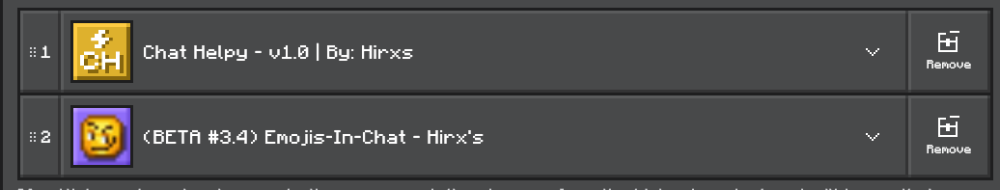

All the essentials of a chat in a single add-on!
--- 
Improve your MC chat experience with chat helpy, add custom ranks, clan tags, change the color of your messages and much more!

## 💻 Compatible and useful for MC Realms & Servers!
- The use of these is totally free and without restrictions! If you want to modify the add-on, no problem, you can do it

## ✨ Features
- Add custom ranks to your MC world or server!
- Change the classic color of messages and player name to a new one!
- Shows the clan/guild you are currently part of in the MC chat!
- Show users which platform/device you are from

## 📄 Chat helpy | Guide

Click to view guide!

> **How to make ranks:**
- `/tag (player name) add "rank:(rank name)"`
   - Example preview:
   - 

> **How to make guild/clan tag:**
- `/tag (player name) add "guild:§e(clan/guild name)"`
   - Example preview:
   - 

> **How to change player name color:**
- `/tag (player name) add "color:(Write a mc vanilla text color here (Example: §a) )"`
   - Example preview:
   - 

> **How to change player messages color:**
- `/tag (player name) add "message:(Write a mc vanilla text color here (Example: §a) )"`
   - Example preview:
   - 

## ‼️ IMPORTANT
- This add-on requires BETA API

## 🔗 COMPATIBILITY
- This add-on is compatible with Emojis-In-Chat, so you can use emojis and have custom ranges at the same time!
### Recommended order:

